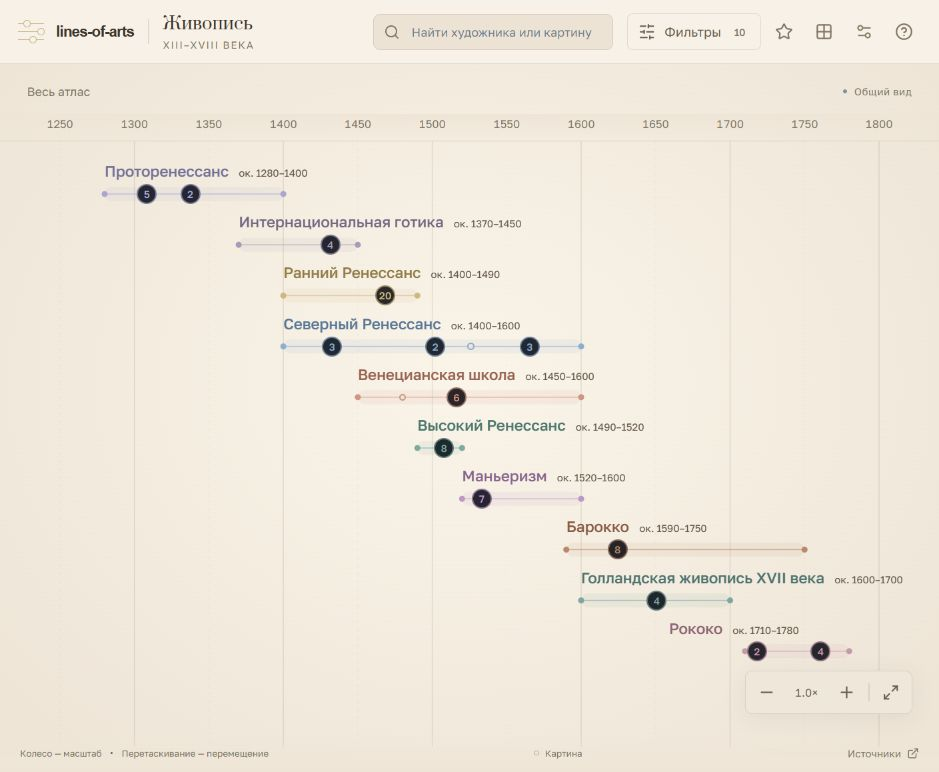

# lines-of-arts

Бесплатный учебный атлас европейской живописи XIII–XVIII веков: хронология, художники, картины и исторические связи с музейными источниками.



## Что внутри

- **10 пересекающихся направлений:** проторенессанс, интернациональная готика, ранний, высокий и северный Ренессанс, венецианская школа, маньеризм, барокко, голландская живопись XVII века и рококо.
- **35 художников и 356 картин.** 80 учебных примеров дополнены 276 музейными работами после удаления совпадений с подборкой. У каждого мастера минимум две работы; у направления — три ключевых произведения с объяснением выбора.
- Полноэкранный холст: плавный масштаб, параллельные линии художников, раскрытие и сворачивание направлений, группировка близких работ.
- Карточки, поиск, галерея и словарь. Избранное отдельно для направлений, художников и картин.
- Русский, английский, испанский и немецкий; белая, тёплая, тёмная и чёрная темы.
- 12 подтверждённых связей обучения, мастерской и сотрудничества. Обсуждаемое отношение Перуджино и Рафаэля включается отдельно.

Колесо масштабирует вокруг указателя, перетаскивание двигает холст. Shift + колесо двигает шкалу горизонтально. На телефоне: один палец для движения, два для масштаба. Клавиатура: стрелки, +, −, 0; Escape закрывает карточку. Ссылка на картину: `?work=vermeer-pearl`.

## Данные и источники

Это учебная подборка живописи, включая фрески, а не полный каталог наследия и не история всех художественных традиций. Архитектура и скульптура не включены. Границы направлений условны; школы развиваются одновременно. Голландская школа показана отдельно для сравнения с другими традициями барокко. Работы сгруппированы по основному направлению художника и могут выходить за его условные даты.

Подписи написаны самостоятельно по музейным каталогам. У каждой картины и биографии есть ссылка на источник; исторические связи подтверждаются отдельными публикациями. Три ключевых произведения — редакционный выбор для обучения. При многолетнем создании точка обозначает представительный год. Линия художника показывает годы жизни, а при неизвестной дате рождения — документированную деятельность, что отмечено в подписи. Изгиб связи не датирует отношение.

- `src/data/content.js`, `artists.js` — исходная подборка Ренессанса.
- `src/data/additional-works.js`, `work-notes.js` — расширенные работы и подсказки.
- `src/data/adjacent-eras.js` — соседние направления, художники, работы и связи.
- `src/data/image-manifest.json` — репродукции, оригинальные URL, права и даты получения. `work-images.json` и `adjacent-image-sources.json` фиксируют выбранные версии.
- `src/utils/canvas-layout.js` — шкала, детализация, строки и группировка.

Репродукции 80 учебных примеров сохранены локально в `public/artworks`: Public domain, CC0 или CC BY 3.0. Для фотографии «Поклонения волхвов» Филиппино Липпи указаны Sailko и CC BY 3.0 в карточке и источниках. Новые репродукции сохраняют пропорции без обрезки. Шрифты Prata и Golos Text находятся в `public/fonts` вместе с лицензиями SIL Open Font License.

Испанский и немецкий подготовлены машинным переводом с редакторскими исправлениями; профессиональная лингвистическая вычитка не проводилась. Переводы статические, запросов к переводчику при просмотре нет. Избранное и настройки сохраняются в браузере без синхронизации. Регистрации, аналитики и cookies нет.

Вдохновение: [Invaluable](https://www.invaluable.com/blog/art-history-timeline/) — учебная хронология; [Deniz Cem Önduygu](https://www.denizcemonduygu.com/philo/browse/) — исследуемая карта. Их код и тексты не копировались.

## Музейный каталог и обратная связь

Каталог импортирует фактические сведения из открытых данных National Gallery of Art, API Cleveland Museum of Art и Art Institute of Chicago, а также официального каталога National Gallery в Лондоне. Это 303 записи для всех 35 художников; 27 уже представлены в учебной подборке. Доступные коллекции не охватывают все известные произведения в мире. Атрибуция и названия сохранены по источнику; работы последователей и мастерских исключены. Отчёт: `docs/museum-coverage.json`.

Изображения новых записей загружаются по необходимости с серверов музеев, только с разрешением Public domain или CC0. Если подходящей открытой репродукции нет, карточка ведёт на официальный источник. Тяжёлые файлы в репозиторий не добавляются. Метаданные статические: посетители не зависят от доступности API для просмотра текста каталога.

Обновление: `npm run sync:museums` (Node.js 22+ и Python 3 со стандартной библиотекой); `npm run sync:museums -- --refresh` обновляет сетевой кэш. Кэш хранится во временной папке системы. После обновления: `npm run check:museums` и `npm run build`.

Обратная связь открывает подготовленное письмо на andreyzh24@gmail.com в почтовом приложении или Gmail. Посетитель отправляет письмо самостоятельно; серверной отправки и хранения сообщений нет. В форме есть ссылки на сайт, Telegram и GitHub разработчика.

## Разработка

React, Vite, Lucide. Node.js 22 или новее.

```sh
npm install
npm run dev
```

На Windows при блокировке PowerShell используйте `npm.cmd`. Адрес: http://127.0.0.1:5173. Сервер слушает локальный адрес.

```sh
npm run check:data
npm run check:interface
npm run check:museums
npm run build
```

Сборка создаёт статический каталог `dist`. `npm run preview` запускает его на http://127.0.0.1:4173.

Репродукции уже включены в репозиторий. Скрипты `fetch-artworks.mjs` и `fetch-reviewed-originals.mjs` нужны только для обслуживания изображений и требуют сети; второй использует Python с Pillow (`ARTS_PYTHON` для пути к интерпретатору). Скрипты перевода также предназначены только для разработки. Предыдущий шаблон сохранён в `docs/templates`.

## Netlify

Подключите [BorgesWrt/lines-of-arts](https://github.com/BorgesWrt/lines-of-arts), ветку `main`. В `netlify.toml` уже указаны команда `npm run build`, каталог `dist` и Node.js 22. Подключение и публикация в Netlify выполняются отдельно.
